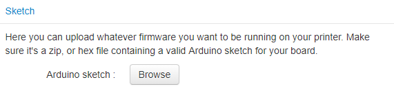
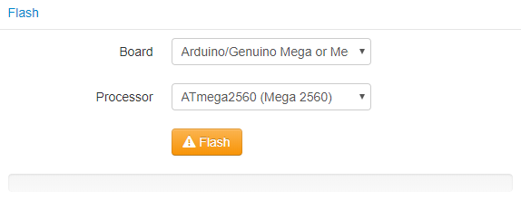

# OctoPrint-Marlin-Flasher

This plugins makes the upgrade of your Marlin (or any Arduino based) firmware possible directly within OctoPrint.
Simply connect to your printer, upload your firmware code, select your motherboard type, and click flash.**DONE**.






## Setup

First, you'll need to download and install `arduino-cli` from their official [GitHub page](https://github.com/arduino/arduino-cli).

Then, install via the bundled [Plugin Manager](https://github.com/foosel/OctoPrint/wiki/Plugin:-Plugin-Manager)
or manually using this URL:

    https://github.com/Renaud11232/Octoprint-Marlin-Flasher/archive/master.zip

## Configuration

There are three configurable options:
* The path to your `arduino-cli` executable
* The name of the Arduino sketch (defaults to `Marlin.ino`)
* The maximum file upload size (defaults to `20MB`)

All can be configured directly though the *Settings* menu. or via the [config.yaml](https://docs.octoprint.org/en/master/configuration/config_yaml.html)

```yaml
plugins:
  marlin_flasher:
    arduino_path: /path/to/arduino-cli
    sketch_ino: Marlin.ino
    max_sketch_size: 20
```

You may also want to add custom boards ie: `Sanguino`. To do that edit the arduino-cli configuration file manually (cf: `arduino-cli` official documentation)

## Step by step

If you need more help on how to setup and use the plugin feel free to check the [wiki](https://github.com/Renaud11232/OctoPrint-Marlin-Flasher/wiki)

## Need help ?

If you need help please [open an issue](https://github.com/Renaud11232/OctoPrint-Marlin-Flasher/issues/new) or join my discord server

[](https://discord.gg/evMfXwT)
